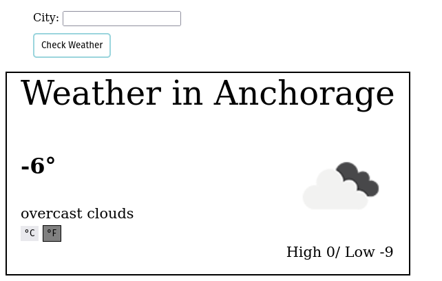

# weather-app

[Live Page](https://sebastienpj.github.io/weather-app/)

A weather app that allows you to look up the weather of a desired city. It uses the Openweathermap API.

Topics learned/reinforced:
- Asynchronous code
- Creating Promises
- Handling errors
- Async/Await synthax
- Working with APIs
- CORS erros